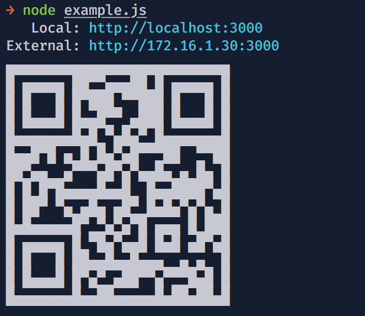

# habu

> Node.jsで自前サーバーを立てながらフロントエンドを開発する時にexternal urlとそのQRコードをconsole.logしてサクッとモバイルからアクセスできるようにするライブラリ

## Usage
```bash
npm i @rxon/habu
```
((꜆꜄ ˙-˙ )꜆꜄꜆
```js
const express = require('express');
const habu = require('@rxon/habu');
const app = express();

app.get('/', function(req, res) {
  res.send('Hello World');
});

app.listen(3000);
habu(3000);
```
((꜆꜄ ˙-˙ )꜆꜄꜆  



## API
`habu(port)`

## Licence

MIT

## Author

rxon